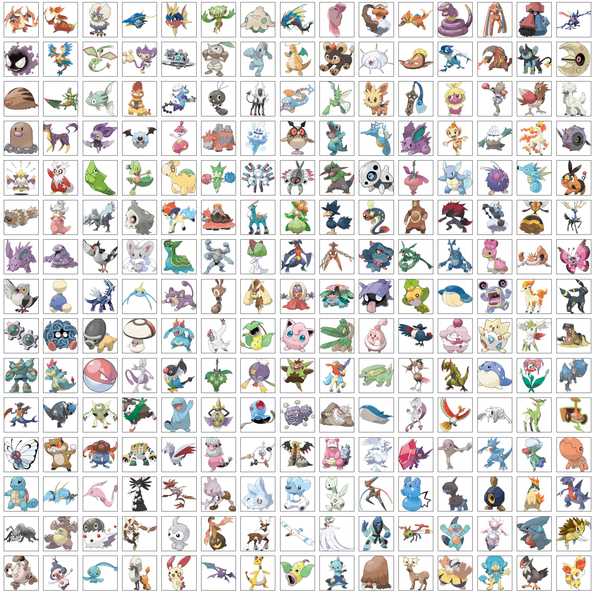

# Generate Pokemon with Diffusion Model
## Introduction
Goal of this repository is to generate new Pokemon with diffusion models using Pytorch.
The dataset of Pokemon images comes from [Pokemon Images Dataset](https://www.kaggle.com/datasets/kvpratama/pokemon-images-dataset) and meta data comes from [Pokemon with stats](https://www.kaggle.com/datasets/abcsds/pokemon).

## Data:
This project use pokemon images as training data, there are a total of 807 images along with their corresponding stats data. 

Following are some example of training data:

## Result
- DDPM Result
generate time: 65 sec

- DDIM
generate time: 13 sec

## Example
Checkout the [example](https://github.com/Mtingggg/pokemon_diffusion/blob/example) and take a try!!
